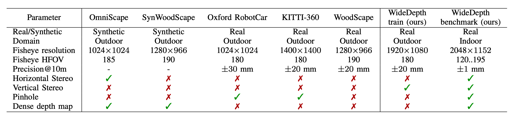

# WideDepth Benchmark: Millimeter-Accurate Fisheye Depth Estimation for Indoor Robotics

[Paper](https://arxiv.org/abs/2605.24074) | [Project Page](https://ilyaind.github.io/WideDepth/) | [Benchmark](https://huggingface.co/datasets/IlyaInd/WideDepth) | [Train set](https://huggingface.co/datasets/IlyaInd/WideDepth-train) | [Code](https://github.com/IlyaInd/widedepth)

  

## Overview

WideDepth is a benchmark for fisheye depth estimation that provides millimeter-accurate indoor ground truth together with diverse camera configurations.

Existing fisheye depth datasets are predominantly outdoor or synthetic and rarely provide dense, high-precision indoor ground truth required for robotics and embodied perception research.

The benchmark supports three tasks: monocular depth estimation, stereo matching, and depth completion.

WideDepth includes high-precision ground truth reconstructed from laser scans, a wide range of fields of view, multiple stereo baselines, both vertical and horizontal stereo configurations, and paired fisheye–pinhole image views.

## Dataset

- **Benchmark** — 101 indoor scenes, 5K fisheye stereo pairs with millimeter-accurate depth and disparity: [IlyaInd/WideDepth](https://huggingface.co/datasets/IlyaInd/WideDepth)
- **Train set** — 18K outdoor fisheye stereo pairs with LiDAR depth: [IlyaInd/WideDepth-train](https://huggingface.co/datasets/IlyaInd/WideDepth-train)
- **Code** — [IlyaInd/widedepth](https://github.com/IlyaInd/widedepth)
